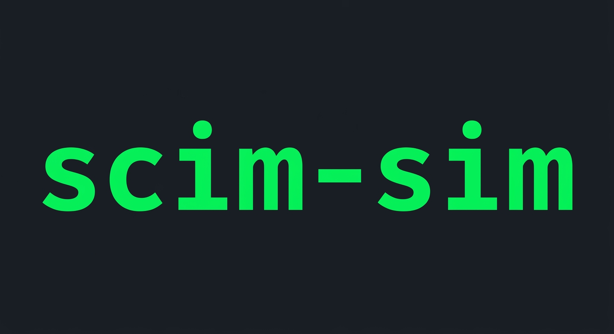

# scim-sim — SCIM Directory Simulator

<p align="center">
  
</p>

<p align="center">
  <a href="https://pypi.org/project/scim-sim/"></a>
  <a href="https://pypi.org/project/scim-sim/"></a>
  <a href="https://opensource.org/licenses/MIT"></a>
</p>

<p align="center">
  A CLI for creating and managing users and groups against any <a href="https://scim.cloud">SCIM</a>-compliant Client. Can be Used to Simulate An IDP Like OKTA, Microsoft, OneIdentity, Jumpcloud etc
</p>

---

## Installation

**Recommended — using [uv](https://docs.astral.sh/uv/getting-started/installation/):**

```bash
uv tool install scim-sim
```

> **First-time setup:** If `scim-sim` is not found after installing, run `uv tool update-shell` and restart your terminal. This is a one-time step that adds `~/.local/bin` to your PATH.

**Alternatively, with pip:**

```bash
pip install scim-sim
```

---

## Configuration

Before using the tool, run setup to configure your SCIM endpoint:

```bash
scim-sim setup
```

This will prompt you for:
- **SCIM Base URL** — the endpoint of your SCIM service (e.g. `https://api.example.com/scim/v2`)
- **SCIM Auth Token** — your authentication token

Configuration is stored in `~/.scim_config.json`. View it anytime with:

```bash
scim-sim config
```

---

## Commands

All commands follow the pattern `scim-sim <command> [args]`. Run `scim-sim --help` or `scim-sim <command> --help` for details.

### User Management

```bash
# Add a new user (generates random user data)
scim-sim add-user

# Remove a user
scim-sim remove-user <user-id>
```

### Group Management

```bash
# Create a new group
scim-sim create-group "Engineering Team"

# Delete a group and permanently delete all its members
scim-sim delete-group <group-id>

# Add a user to a group
scim-sim add-to-group <user-id> <group-id>

# Remove a user from a group
scim-sim remove-from-group <user-id> <group-id>
```

> **Warning:** `delete-group` permanently deletes all users that belong to the group, not just the group itself.

### Directory Visualization

```bash
scim-sim show
```

Displays a tree view of your full directory structure — groups, members, and ungrouped users.

```
📂 Directory
├── 👥 Groups
│   ├── Engineering Team │ ID: dirgroup_1234567890123456
│   │    ├── 👤 avinash.kamath@example.com │ ID: diruser_8913202356420102
│   │    └── 👤 srini.k@example.com        │ ID: diruser_4123456789012345
│   │
│   └── Product Team │ ID: dirgroup_6789012345678901
└── 👤 Ungrouped Users
    └── ravi@example.com │ ID: diruser_6789012345678901
```

---

## Command Reference

| Command | Description |
|---|---|
| `setup` | Configure SCIM endpoint and auth token |
| `config` | View current configuration |
| `add-user` | Create a new randomly generated user |
| `remove-user <id>` | Delete a user |
| `show` | Display full directory structure |
| `create-group <name>` | Create a new group |
| `delete-group <id>` | Delete a group and all its members |
| `add-to-group <user-id> <group-id>` | Add a user to a group |
| `remove-from-group <user-id> <group-id>` | Remove a user from a group |
